# ESP32 Hybrid LED Driver System

This project implements a high-performance, modular LED control system for the ESP32 (ESP-IDF). It supports a hybrid architecture combining **WS2812B Addressable Strips** (via RMT) and **PCA9955B Constant Current Drivers** (via I2C).

## 📂 Module Structure

The project is organized into four distinct layers, ranging from hardware configuration to high-level application control.

| Module | File Name | Description |
| :--- | :--- | :--- |
| **01** | [BoardConfig](docs/01-BoardConfig.md) | **HAL Config.** Defines GPIO pins... |
| **02** | [ws2812b_hal](docs/02-ws2812b.md) | **RMT Driver.** Optimized, non-blocking... |
| **03** | [pca9955b_hal](docs/03-pca9955b.md) | **I2C Driver.** Shadow-buffered driver... |
| **04** | [LedController](docs/04-LedController.md) | **Application API.** Unified C++ class... |

## 🏗 Architecture

```mermaid
graph TD
    UserApp[User Application] --> LedController
    
    subgraph "High Level"
        LedController[04 - LedController]
    end

    subgraph "Drivers"
        WS[02 - WS2812B HAL]
        PCA[03 - PCA9955B HAL]
    end

    subgraph "Configuration"
        Config[01 - BoardConfig]
    end

    LedController --> WS
    LedController --> PCA
    WS --> Config
    PCA --> Config
```



## 🚀 Quick Start (ESP-IDF)

### 1. Configuration
Open `BoardConfig.h` to define your hardware setup:
* Set `WS2812B_NUM` for the number of strips.
* Set `PCA9955B_NUM` for the number of driver ICs.
* Update `BOARD_HW_CONFIG` with your specific GPIO pins.

### 2. Integration Example
Include the main header in your C++ application (`main.cpp`):

```cpp
#include "LedController.hpp"
#include "BoardConfig.h"
#include "freertos/FreeRTOS.h"
#include "freertos/task.h"

// Define main entry point with C linkage for ESP-IDF
extern "C" void app_main(void) {
    
    // 1. Setup Pixel Counts (CRITICAL: Must be done before init)
    // Example: Strip 0 has 60 LEDs, Strip 1 has 144 LEDs...
    ch_info.rmt_strips[0] = 60;
    ch_info.rmt_strips[1] = 144; 
    // ... initialize other active channels

    // 2. Instantiate & Initialize Controller
    static LedController leds;
    if (leds.init() != ESP_OK) {
        ESP_LOGE("MAIN", "Failed to initialize LED Controller");
        return;
    }

    // 3. Main Loop
    while (1) {
        // Set a global color (Red)
        leds.fill(255, 0, 0);
        
        // Update the display
        leds.show();
        
        // Delay 100ms
        vTaskDelay(pdMS_TO_TICKS(100));
    }
}
```

## ⚡ Key Features & Technical Notes

### 1. Interleaved Parallel Execution (Anti-Glitch Strategy)
The `show()` function utilizes a **split-batch strategy**. Instead of firing all RMT channels at once, it interleaves RMT and I2C commands (e.g., `WS_Batch1` -> `PCA_Batch1` -> `WS_Batch2` -> `PCA_Batch2`).

> **⚠️ Why?** > It was observed that triggering all **8 RMT channels simultaneously** caused signal instability and **glitches** on the data lines due to high system resource contention. Splitting the transmission load into two halves eliminates these glitches while maintaining high frame rates by overlapping I2C blocking time with RMT transmission time.

### 2. Robustness (I2C Auto-Recovery)
The I2C driver actively monitors for transmission failures. If a PCA9955B chip resets (losing its `IREF` current gain settings) due to a power dip, the driver automatically detects this and restores the registers in the next frame, preventing permanent display blackouts.

### 3. Zero-Copy Architecture
Where possible, data is written directly to the driver's internal buffers using `write_buffer()`. The PCA9955B driver handles the necessary `GRB` to `RGB` format conversion internally during the write process.