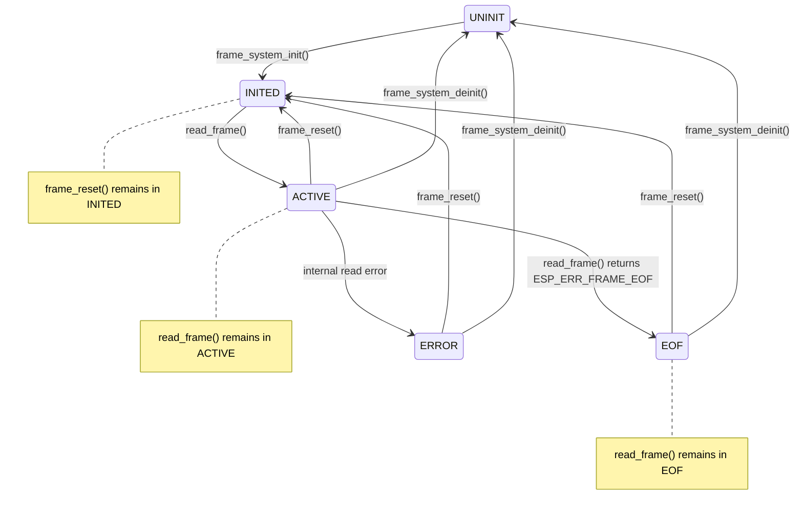

# Pattern Table Reader System v1.2 Guide 

This document explains what the pattern table reader system provides, how to use it correctly, and what assumptions the system makes. 

## 1. Finite State Machine

define variable
```
static bool inited; 
static bool running; 
static bool eof_reached;
statid bool has_error;
```

The finite state machine of pattern table reader system:



Description of each state :


|  State   | Description  | Static variable  |
|  :---:  | :---  | :---  |
| UNINIT  | Pattern table reader system not yet initialize | inited = 0 <br> running = 0 <br> eof_reached = 0 |
| INITED  | Pattern table reader system inited, ready to read | inited = 1 <br> running = 1 <br> eof_reached = 0 |
| ACTIVE  | System is reading frame | inited = 1 <br> running = 1 <br> eof_reached = 0 |
| EOF  | Frame reader reach end of file in frame.dat | inited = 1 <br> running = 1 <br> eof_reached = 1 |
| STOPPED  | System deinitialized, resources released | inited = 0 <br> running = 0 <br> eof_reached = 0 |


## 2. FSM API

### 1. frame_system_init(const char* control_path, const char* frame_path)

Initialize the pattern table reader system

|  Current state   |  Next state   | Return |
|  :---  | :---  | :---  |
| UNINIT  | INITED | ESP_OK |
| INITED  | INITED | ESP_ERR_INVALID_STATE |
| ACTIVE  | ACTIVE | ESP_ERR_INVALID_STATE |
| EOF  | EOF | ESP_ERR_INVALID_STATE |
| STOPPED  | STOPPED | ESP_ERR_INVALID_STATE |

<br>

- Detail Error Code Reference

| Return type                | Description                                                            |
| :------------------------- | :--------------------------------------------------------------------- |
| `ESP_OK`                   | Initialization succeeded                                               |
| `ESP_ERR_INVALID_STATE`    | System already initialized                                             |
| `ESP_ERR_NOT_FOUND`        | SD card not found, `control.dat` not found, or `frame.dat` open failed |
| `ESP_ERR_INVALID_ARG`      | Invalid input path                                                     |
| `ESP_ERR_NO_MEM`           | Failed to create semaphores                                            |
| `ESP_ERR_INVALID_RESPONSE` | `control.dat` format error                                             |
| `ESP_ERR_INVALID_CRC`      | `control.dat` checksum mismatch                                        |
| `ESP_ERR_NOT_SUPPORTED`    | `control.dat` version mismatch                                         |
| `ESP_ERR_INVALID_SIZE`     | Calculated frame size exceeds `FRAME_RAW_MAX_SIZE`                     |
| `ESP_FAIL`                 | Generic I/O or version read failure                                    |

---

### 2. read_frame(table_frame_t* playerbuffer)

Reading next frame data

|  Current state   |  Next state   | Return |
|  :---  | :---  | :---  |
| UNINIT  | UNINIT | ESP_ERR_INVALID_STATE |
| INITED  | ACTIVE | ESP_OK |
| ACTIVE  | ACTIVE | ESP_OK |
| ACTIVE  | EOF | ESP_ERR_NOT_FOUND |
| EOF  | EOF | ESP_ERR_NOT_FOUND |
| STOPPED  | STOPPED | ESP_ERR_INVALID_STATE |

<br>

- Detail Error Code Reference

| Return type             | Description                                                                   |
| :---------------------- | :---------------------------------------------------------------------------- |
| `ESP_OK`                | Frame read successfully                                                       |
| `ESP_ERR_INVALID_STATE` | System not initialized                                                        |
| `ESP_ERR_INVALID_ARG`   | `playerbuffer == NULL`                                                        |
| `ESP_ERR_TIMEOUT`       | Failed to wait for ready semaphore                                            |
| `ESP_ERR_FRAME_EOF`     | End of `frame.dat` reached                                                    |
| `ESP_ERR_INVALID_CRC`   | Frame checksum mismatch                                                       |
| `ESP_FAIL`              | Generic frame read error, short read, consume mismatch, or FATFS read failure |


---

### 3. frame_reset(void)

Reset reader pointer back to start of frame.dat (frame 0)

|  Current state   |  Next state   | Return |
|  :---  | :---  | :---  |
| UNINIT  | UNINIT | ESP_ERR_INVALID_STATE |
| INITED  | INITED | ESP_OK |
| ACTIVE  | INITED | ESP_OK |
| EOF  | INITED | ESP_OK |
| STOPPED  | STOPPED | ESP_ERR_INVALID_STATE |

---

### 4. frame_system_deinit(void)

Leave and close the pattern table reader system, release resource

|  Current state   |  Next state   | Return |
|  :---  | :---  | :---  |
| UNINIT  | UNINIT | ESP_ERR_INVALID_STATE |
| INITED  | UNINIT | ESP_OK |
| ACTIVE  | UNINIT | ESP_OK |
| EOF  | UNINIT | ESP_OK |
| STOPPED  | UNINIT | ESP_OK |


| Return type             | Description            |
| :---------------------- | :--------------------- |
| `ESP_OK`                | Deinit succeeded       |
| `ESP_ERR_INVALID_STATE` | System not initialized |


## 3. Other API

### is_eof_reached(void)

- return eof_reached ( True / False )

### get_sd_card_id(void)

- return ID 1~31 if label of SD card is "LPS01" ~ "LPS31"

- return 0 for other cases