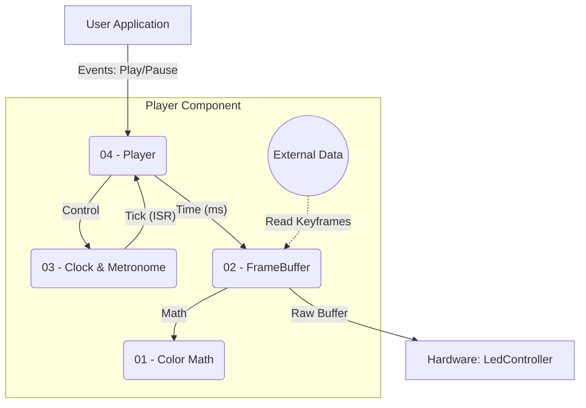

# ESP32 Animation Player Component

The **Player Component** is the high-level logic engine responsible for rendering complex LED animations. Unlike the hardware drivers (which simply push bytes), the Player handles the concept of **Time**, **Keyframes**, and **Interpolation**.

It is designed as a thread-safe Singleton that runs in a dedicated FreeRTOS task, ensuring smooth animation playback regardless of other system loads (e.g., WiFi or User Input).

## 📚 Module Documentation

The component is divided into four logical sub-modules. Click the links below for detailed implementation notes:

| Module | File Name | Description |
| :--- | :--- | :--- |
| **01** | [Color Math](docs/01-color.md) | **Core Utilities.** High-performance integer math, 16-bit Hue resolution, and HSV/RGB conversion algorithms. |
| **02** | [FrameBuffer](docs/02-framebuffer.md) | **Animation Engine.** Handles keyframe storage, timeline advancement, and real-time color interpolation (Linear/Step). |
| **03** | [PlayerClock](docs/03-player_clock.md) | **Timing System.** Manages the playback timeline (Play/Pause/Reset) and hardware metronome (GPTimer) for precise tick generation. |
| **04** | [PlayerEngine](docs/04-player.md) | **Main Controller.** The central FSM (Finite State Machine) that coordinates the Clock, FrameBuffer, and LED Hardware. |

## 🏗 System Architecture

The Player acts as the bridge between your **Data Source** (SD Card/Flash) and the **Hardware Drivers** (LedController).



## ⚡ Key Features

1.  **Thread-Safe Architecture:** All public API calls (`play()`, `load()`) function as asynchronous events sent to a high-priority Queue. The main player loop processes these events safely.
2.  **Smooth Interpolation:** Uses **HSV Interpolation** with `0-1535` Hue resolution (instead of standard 0-255) to prevent color banding during slow transitions.
3.  **Precise Timing:** Uses a hardware **GPTimer** (Metronome) to wake the rendering task, ensuring jitter-free frame updates (e.g., steady 100 FPS).
4.  **Resource Optimization:**
    * **Lazy Loading:** Heavy buffers are only allocated when the player enters the `READY` state.
    * **Zero-Copy Rendering:** The FrameBuffer writes directly into the format required by the hardware drivers.

## 🚀 Usage Example

The Player is a Singleton. You typically initialize it in your `app_main`, then control it via user inputs.

```cpp
#include "player.hpp"

// Define the external data fetcher (Required by FrameBuffer)
void test_read_frame(table_frame_t* frame) {
    // Implement your logic to read from SD card / Flash here
}

extern "C" void app_main(void) {
    // 1. Initialize the Player Task
    Player::getInstance().init();
    
    // Wait for initialization...
    vTaskDelay(pdMS_TO_TICKS(100));

    // 2. Start Playback
    Player::getInstance().play();

    // 3. Runtime Control
    while(1) {
        // Example: Pause after 5 seconds
        vTaskDelay(pdMS_TO_TICKS(5000));
        Player::getInstance().pause();
        
        // Example: Resume after 2 seconds
        vTaskDelay(pdMS_TO_TICKS(2000));
        Player::getInstance().play();
    }

}
```

## 📂 Directory Structure

Recommended structure for the `components/Player` directory:

```text
components/Player/
├── docs/                      <-- Documentation modules
│   ├── 01-color.md
│   ├── 02-framebuffer.md
│   ├── 03-player_clock.md
│   └── 04-player_engine.md
├── include/                   <-- Public Headers
│   ├── color.h
│   ├── framebuffer.h
│   ├── player_clock.h
│   ├── player_protocol.h      <-- Event & Struct definitions
│   └── player.hpp          <-- Main Class
├── src/                       <-- Source Code
│   ├── framebuffer.cpp
│   ├── player_clock.cpp
│   ├── player_fsm.cpp         <-- State Machine Logic
│   └── player.cpp          <-- Task & Main Loop
├── CMakeLists.txt
└── README.md                  <-- This file
```