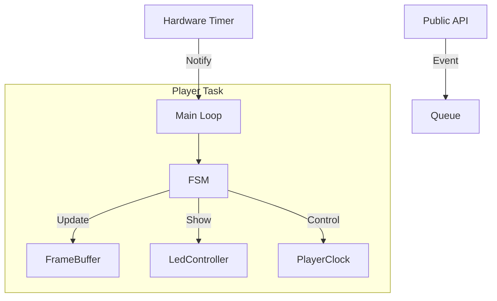
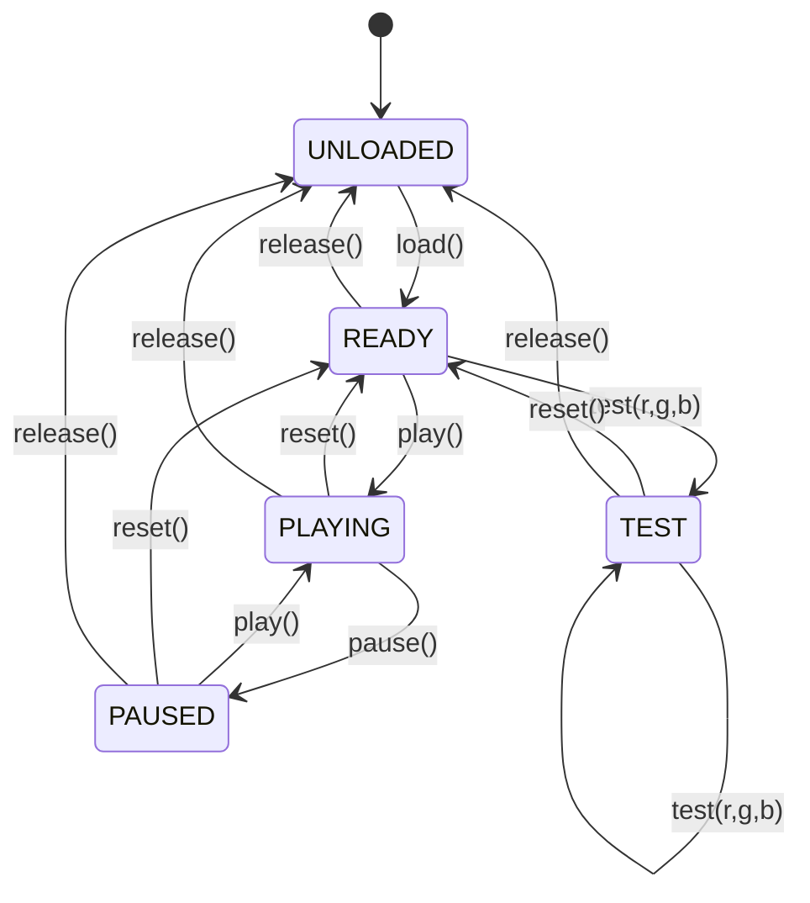

# 04 - Player Engine (Core FSM)

The **Player** class (`Player`) is the central orchestrator of the system. It implements a **Singleton** pattern and runs a comprehensive **Finite State Machine (FSM)** within a dedicated high-priority RTOS task.

## 1. Overview

* **Role:** Coordinator. It ties together the Timer (Clock), Animation (FrameBuffer), and Hardware (LedController).
* **Concurrency:** Thread-safe. Public methods (like `play()`) send events to a queue; the internal loop processes them sequentially.
* **Resource Management:** Dynamically allocates/frees heavy resources (buffers, drivers) based on the state (Loaded vs Unloaded).

---

## 2. Architecture

The Player operates on an **Event-Driven** architecture.

1.  **Public API:** Callers (e.g., WiFi task, Button task) call `play()`, `pause()`, etc.
2.  **Event Queue:** These commands are packaged into `Event` structs and pushed to a FreeRTOS Queue.
3.  **Player Task:** The main loop waits for two types of signals:
    * **Events:** State transitions (Play, Pause, Load).
    * **Notifications:** Metronome ticks (for frame updates).
4.  **FSM:** The event is routed to the current state handler logic to determine the valid transition.

### Dependency Graph



---

## 3. Finite State Machine (FSM)

The Player enforces a strict state lifecycle to prevent undefined behaviors (e.g., trying to play before hardware is initialized).

### States

| State | Description | Resources |
| :--- | :--- | :--- |
| **UNLOADED** | System idle. No drivers initialized. Memory is free. | Released |
| **READY** | Drivers initialized. Buffer cleared. Waiting for command. | Acquired |
| **PLAYING** | Animation is running. Clock is advancing. | Acquired |
| **PAUSED** | Animation frozen. Clock stopped. | Acquired |
| **TEST** | Static color output mode (for hardware debug). | Acquired |

### Transition Diagram



---

## 4. Implementation Details

### 4.1 The Main Loop (`Loop()`)

The loop uses `xTaskNotifyWait` to efficiently sleep until work is needed. It handles priority inversion by processing **Queue Events** (Commands) before **Update Signals** (Frame rendering).

```cpp
void Loop() {
    while(running) {
        // Wait for Event or Metronome Tick
        xTaskNotifyWait(0, UINT32_MAX, &bits, portMAX_DELAY);

        // 1. Handle Command Events (High Priority logic changes)
        if (bits & NOTIFICATION_EVENT) {
            while(xQueueReceive(eventQueue, &e, 0)) {
                processEvent(e); // FSM Transition
            }
        }

        // 2. Handle Frame Update (High Frequency rendering)
        if (running && (bits & NOTIFICATION_UPDATE)) {
            updateState(); // fb.compute() -> controller.show()
        }
    }
}
```

### 4.2 Resource Management (`acquire/release`)
To optimize RAM usage, the Player only holds heavy resources (like the FrameBuffer's `frame_data` or the LED Controller's shadow buffers) when not in the `UNLOADED` state.
* **On `load()`:** Calls `controller.init()`, `fb.init()`, `clock.init()`.
* **On `release()`:** Calls `deinit()` on all components.

---

## 5. API Reference

All public methods are thread-safe and return `ESP_OK` if the event was successfully queued.

### Lifecycle
```cpp
// Starts the Player Task. Must call before anything else.
esp_err_t init(); 
```

### Commands
```cpp
esp_err_t load();    // Initialize hardware -> Goto READY
esp_err_t play();    // Start animation -> Goto PLAYING
esp_err_t pause();   // Freeze animation -> Goto PAUSED
esp_err_t reset();   // Stop and rewind to 0 -> Goto READY
esp_err_t release(); // Free hardware -> Goto UNLOADED
```

### Debugging
```cpp
// Shows a static color immediately (useful for testing wiring)
esp_err_t test(uint8_t r, uint8_t g, uint8_t b);
```