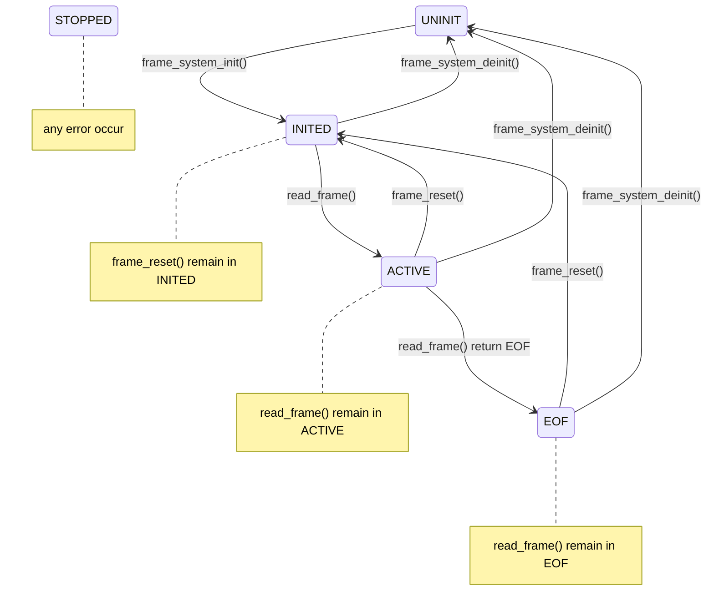

# Pattern Table Reader System v1.2 Guide 

This document explains what the pattern table reader system provides, how to use it correctly, and what assumptions the system makes. 

## 1. Finite State Machine

define variable
```
static bool inited; 
static bool running; 
static bool eof_reached;
```

The finite state machine of pattern table reader system:



Description of each state :


|  State   | Description  | Static variable  |
|  :---:  | :---  | :---  |
| UNINIT  | Pattern table reader system not yet initialize | inited = 0 <br> running = 0 <br> eof_reached = 0 |
| INITED  | Pattern table reader system inited, ready to read | inited = 1 <br> running = 1 <br> eof_reached = 0 |
| ACTIVE  | System is reading frame | inited = 1 <br> running = 1 <br> eof_reached = 0 |
| EOF  | Frame reader reach end of file in frame.dat | inited = 1 <br> running = 1 <br> eof_reached = 1 |
| STOPPED  | System deinitialized, resources released | inited = 0 <br> running = 0 <br> eof_reached = 0 |


## 2. FSM API

### 1. frame_system_init(const char* control_path, const char* frame_path)

Initialize the pattern table reader system

|  Current state   |  Next state   | Return |
|  :---  | :---  | :---  |
| UNINIT  | INITED | ESP_OK |
| INITED  | INITED | ESP_ERR_INVALID_STATE |
| ACTIVE  | ACTIVE | ESP_ERR_INVALID_STATE |
| EOF  | EOF | ESP_ERR_INVALID_STATE |
| STOPPED  | STOPPED | ESP_ERR_INVALID_STATE |

<br>

- Detail Error Code Reference

|  Return type   |  Description |
|  :---  | :---  |
| ESP_ERR_INVALID_STATE  | System already initialized (inited = True) |
| ESP_ERR_INVALID_ARG  | Invalid control_path or frame_path |
| ESP_ERR_NOT_FOUND  | control.dat or frame.dat missing on SD card |
| ESP_FAIL | Version mismatch or I/O error |
| ESP_ERR_INVALID_RESPONSE | control.dat format error (invalid values) |
| ESP_ERR_NO_MEM | Out of memory |
| ESP_ERR_INVALID_SIZE | Calculated frame size exceeds FRAME_RAW_MAX_SIZE |
| ESP_ERR_INVALID_CRC | Checksum mismatch in control.dat |

---

### 2. read_frame(table_frame_t* playerbuffer)

Reading next frame data

|  Current state   |  Next state   | Return |
|  :---  | :---  | :---  |
| UNINIT  | UNINIT | ESP_ERR_INVALID_STATE |
| INITED  | ACTIVE | ESP_OK |
| ACTIVE  | ACTIVE | ESP_OK |
| ACTIVE  | EOF | ESP_ERR_NOT_FOUND |
| EOF  | EOF | ESP_ERR_NOT_FOUND |
| STOPPED  | STOPPED | ESP_ERR_INVALID_STATE |

<br>

- Detail Error Code Reference

|  Return type   |  Description |
|  :---  | :---  |
| ESP_ERR_INVALID_STATE  | Called in UNINIT or STOPPED state |
| ESP_ERR_NOT_FOUND  | No more frames to read, system enters EOF state |
| ESP_ERR_INVALID_SIZE | Frame file corrupted: incomplete frame read (expected size mismatch) |
| ESP_ERR_INVALID_ARG  | Invalid playerbuffer or NULL |
| ESP_ERR_INVALID_CRC  | Checksum mismatch in frame.dat |
| ESP_FAIL | Reader task stopped or I/O error |

---

### 3. frame_reset(void)

Reset reader pointer back to start of frame.dat (frame 0)

|  Current state   |  Next state   | Return |
|  :---  | :---  | :---  |
| UNINIT  | UNINIT | ESP_ERR_INVALID_STATE |
| INITED  | INITED | ESP_OK |
| ACTIVE  | INITED | ESP_OK |
| EOF  | INITED | ESP_OK |
| STOPPED  | STOPPED | ESP_ERR_INVALID_STATE |

---

### 4. frame_system_deinit(void)

Leave and close the pattern table reader system, release resource

|  Current state   |  Next state   | Return |
|  :---  | :---  | :---  |
| UNINIT  | UNINIT | ESP_ERR_INVALID_STATE |
| INITED  | UNINIT | ESP_OK |
| ACTIVE  | UNINIT | ESP_OK |
| EOF  | UNINIT | ESP_OK |
| STOPPED  | UNINIT | ESP_OK |

## 3. Other API

### is_eof_reached(void)

- return eof_reached ( True / False )

### get_sd_card_id(void)

- return ID 1~31 if label of SD card is "LPS01" ~ "LPS31"

- return 0 for other cases